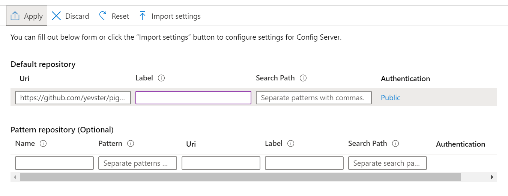

# Migrate a Spring Cloud App

In this section, we're going to take a pre-existing Spring Cloud application, consisting of four microservices, and migrate it to Azure Spring Cloud in its entirety.

We will use this migrated application in the subsequent section to demonstrate the monitoring, scaling, and tracing capabilities of Azure Spring Cloud.

## Creating an Azure Spring Cloud instance

For expediency, let's create the Azure Spring Cloud instance from Azure CLI.

> 🛑 Modify the command below to include the desired name of the Azure Spring Cloud instance, as well as the resource group and the location used in the previous section. __Azure Spring Cloud instance names must be globally unique.__.
```bash
az spring-cloud create --name ${SPRING_CLOUD_SERVICE} \
    --resource-group ${RESOURCE_GROUP_NAME}
```

## Configure defaults in your development machine

You can set defaults so that you do not have to repeatedly mention resource group, location and service name in your subsequent calls to Azure Spring Cloud:

```bash
# Configure defaults
az configure --defaults \
    group=${RESOURCE_GROUP_NAME} \
    location=${REGION} \
    spring-cloud=${SPRING_CLOUD_SERVICE}
```

## Configure Observability and Troubleshooting Features

Before we deploy microservices to the newly-created Azure Spring Cloud instance, we should enable log aggregation and distributed tracing. We do this upfront for two reasons:

1. Configuration changes take time to apply, so the sooner we register the changes, the sooner we can make use of them.

1. If one of the microservices fails to come up, perhaps due to a misconfiguration, being able to query its output in Log Analytics will help us troubleshoot it.

### Configure Distributed Tracing

Distributed tracing allows you to observe interaction among microservices and diagnose issues. We will see this feature in action in Section 5, but because its configuration requires some time to be applied, let's enable it now:

- Go to the [the Azure portal](https://portal.azure.com/).
- Go to the Azure Spring Cloud instance and click on "Distributed Tracing" (under Monitoring).
  - Click on "Edit Settings" and select the App Insights workspace created in Section 00 (named `sclab-ai-<unique string>`).
  - Once the Application Insights configuration is saved, click "Enable" at the top of the "Distributed Tracing" pane.

The confriguration settings for distirbuted tracing take some time to apply, so we'll play with log aggregation next and come back to distributed tracing later.

### Configure log aggregation

There are actually three ways to access your application's logs: [Azure Storage](https://docs.microsoft.com/en-us/azure/storage/common/storage-introduction/), [Azure Events Hub](https://docs.microsoft.com/en-us/azure/event-hubs/), and [Log Analytics](https://docs.microsoft.com/en-us/azure/azure-monitor/log-query/get-started-portal). We will focus here on Log Analytics as it's the most common one, and as it's integrated into Azure Spring Cloud.

[Log Analytics](https://docs.microsoft.com/en-us/azure/azure-monitor/log-query/get-started-portal/) is part of [Azure Monitor](https://azure.microsoft.com/en-us/services/monitor/), which is well-integrated into Azure Spring Cloud, and which we will also use for metrics monitoring.

Having completed the setup in Section 00, you should have a Log Analytics workspace named `sclab-la-<unique string>`. We must now configure our Azure Spring Cloud  instance to send its data to this workspace.

- Go to the "Overview" page of your Azure Spring Cloud instance, and select "Diagnostic settings" in the "Monitoring" section of the navigation pane.
- Click on "Add diagnostic setting" and configure your instance to send all its logs to the Log analytics workspace that we just created.
- Fill in the values as shown here and click "Save".


## Deploying the configuration server

In an invididual Spring Boot microservice, the configurationis typically provided in an accompanying file called `application.yml` or `application.properties`. But if we were to deploy multiple Spring Boot microservices in this fashion, settings would have to be duplicated across mulitple microservices.

Spring Cloud simplifies configuration management by centralizing configuration in a single configuration server. Azure Spring Cloud extends this functionality by provisioning and managing a Config Server directly from a git repository containing configuration.

- Go to the overview page of your Azure Spring Cloud server, and select "Config server" in the menu
- Configure the repository we previously created:
  - Add the repository URL. To save time, we host a public repository with the configuration for Piggy Metrics at `https://github.com/yevster/piggymetrics-config.git`. However, in real-world a private repository would be used. A Private Access Token can then be entered by clicing the link under "Authentication". For the purposes of this lab, let the Authentication type remain `Public`, and click "Apply":

  

- Click on "Apply" and wait for the operation to succeed. Azure Spring Cloud will now create a configuration server to provide configuration to all microservices, with no further effort from you.

## Creating the apps

In the previous section, you provisioned an App, to host a single microservice, in the Azure Portal. We will now need to provision five apps: four for each of the microservices we plan to migrate, plus one for the gateway, which will host the UI and expose our microservices to the public. For expediency, we will perform these tasks from the Azure CLI:

```bash
# Create an app for the gateway + UI
az spring-cloud app create --name gateway --instance-count 1 --is-public true &

# Create an app for each of the microservices
az spring-cloud app create --name account-service --instance-count 1 &
az spring-cloud app create --name auth-service --instance-count 1 &
az spring-cloud app create --name statistics-service --instance-count 1 &
az spring-cloud app create --name notification-service --instance-count 1 &
```

While waiting for the creation to complete, you can move on to the next section, "Building the apps". Do not, however, move beyond it until all the commands above have finished executing (you can see the active tasks with the `jobs` command).

## Building the apps

Run

```bash
cd piggymetrics
mvn clean package -DskipTests -Denv=cloud
```

## Create the service binding for CosmosDB

Prior to the migration, the application connected to MongoDB at an explicitly provided endpoint with explicitly provided redentials. In Azure Spring Cloud, we can instead create flexible service bindings that will inject that configuration.

So in place of MongoDB, we will inject CosmosDB configuration into each of the apps we just created. For expediency, we will use Azure CLI to accomplish this task.

```bash
COSMOS_ACCOUNT_ID=$(az cosmosdb list --query '[].id' -o tsv)

az spring-cloud app binding cosmos add --api-type mongo --app account-service -n cosmos --resource-id "${COSMOS_ACCOUNT_ID}" --database-name account-db
az spring-cloud app binding cosmos add --api-type mongo --app auth-service -n cosmos --resource-id "${COSMOS_ACCOUNT_ID}" --database-name auth-db
az spring-cloud app binding cosmos add --api-type mongo --app notification-service -n cosmos --resource-id "${COSMOS_ACCOUNT_ID}" --database-name notification-db
az spring-cloud app binding cosmos add --api-type mongo --app statistics-service -n cosmos --resource-id "${COSMOS_ACCOUNT_ID}" --database-name statistics-db

```

## Deploying the apps

Some of the migrated applications require an RabbitMQ broker. We have deployed one in an Azure Containber Instance in the ARM template in Section 0. We need to obtain set some environment variables and populate them in the deployed microservices:

```bash
RABBITMQ_HOST=$(az container list --query '[0].ipAddress.fqdn' -o tsv)
RABBITMQ_PORT=5672
RABBITMQ_USERNAME=default
RABBITMQ_PASSWORD='super$ecr3t' #password provided when deploying the ARM template

# MongoDB Connection String to CosmosDB
MONGODB_URI=$(az cosmosdb keys list \
    -n $(az cosmosdb list --query '[0].name' -o tsv) \
    --type connection-strings -o tsv \
    --query 'connectionStrings[0].connectionString')
```

Deploy the webapps using the `az spring cloud deploy` command.

```bash

# Deploy gateway app
az spring-cloud app deploy --name gateway \
    --jar-path gateway/target/gateway.jar \

# Deploy auth-service app
az spring-cloud app deploy --name auth-service \
    --jar-path auth-service/target/auth-service.jar

# Deploy account-service app
az spring-cloud app deploy --name account-service \
    --jar-path account-service/target/account-service.jar \
    --env RABBITMQ_HOST=${RABBITMQ_HOST} \
          RABBITMQ_PORT=${RABBITMQ_PORT} \
          RABBITMQ_USERNAME=${RABBITMQ_USERNAME} \
          RABBITMQ_PASSWORD=${RABBITMQ_PASSWORD}

# Deploy statistics-service app
az spring-cloud app deploy --name statistics-service \
    --jar-path statistics-service/target/statistics-service.jar \
    --env RABBITMQ_HOST=${RABBITMQ_HOST} \
          RABBITMQ_PORT=${RABBITMQ_PORT} \
          RABBITMQ_USERNAME=${RABBITMQ_USERNAME} \
          RABBITMQ_PASSWORD=${RABBITMQ_PASSWORD}

# Deploy notification-service app
az spring-cloud app deploy --name notification-service \
    --jar-path notification-service/target/notification-service.jar \
    --env RABBITMQ_HOST=${RABBITMQ_HOST} \
          RABBITMQ_PORT=${RABBITMQ_PORT} \
          RABBITMQ_USERNAME=${RABBITMQ_USERNAME} \
          RABBITMQ_PASSWORD=${RABBITMQ_PASSWORD}

```

While waiting for the deployments to complete, this is a good time to navigate into the Azure Spring Cloud instance in Azure Portal. Click on "Apps" to see the status. Eventually, all Apps should have the status `Running`.


Once all apps have the status `Running`, click on the Gateway app. In the PiggyMetrics application, this app also contains the UI. So copy the value in the `URL` field on `gateway`'s app page, and paste it into a browser.

You should see the front page of the PiggyMetrics app. Click "Create new account", and once you've created an account, play around with the application for a couple of minutes to generate some log and traffic data. Then, proceed to the next section.

