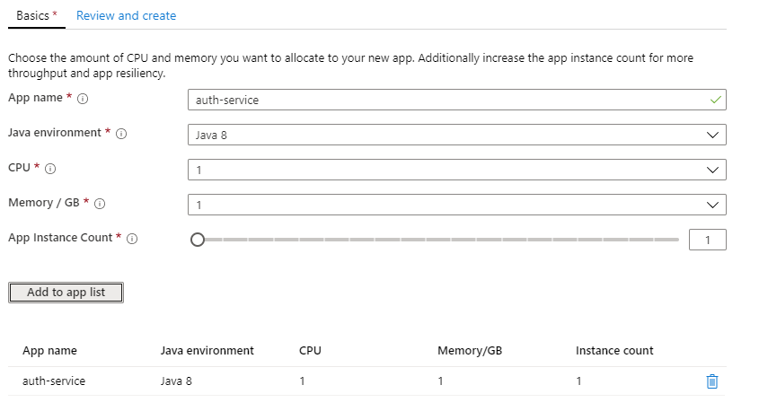
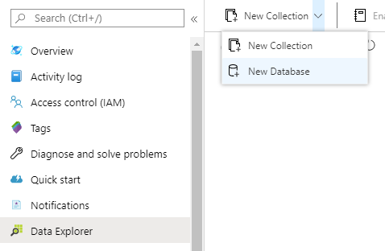
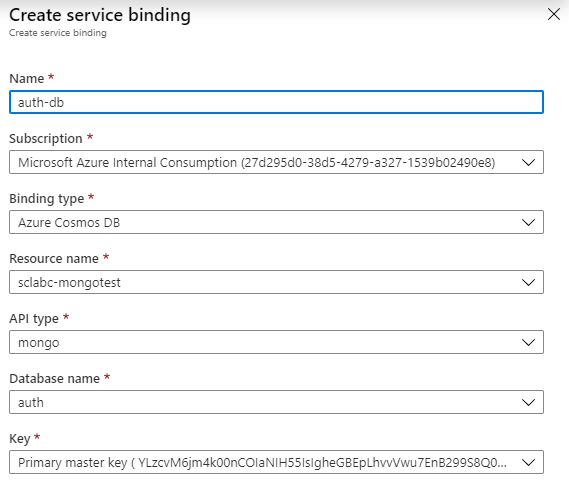

# Migrating Single Microservice

While Spring Cloud is steadily growing in popularity, there are many Spring Boot Microservices that do not yet leverage Spring Cloud technologies.

Because every Spring Microservice can be a Spring Cloud Microservice, we shall first Migrate one such Microservice to Azure Spring Cloud.

## Configuring a Spring Microservice

Attached to this section is a single containerized Spring Microservice. We also include a containerized Mongo DB deployment and a `docker-compose` orchestration to make the two work together.

* Open `auth-service/src/main/resources/application.yml`.

This file provides the configuration for the microservice. This configuration often includes connection information for the backing database. These settings could be externalized to another configuration file or to environment variables, but ultimately, with ordinary Spring microservices, it is the responsibility of the developer/deployer to provide this configuration.

When we deploy this Microservice to Azure Spring Cloud, the platform will inject the database information automatically. It will also take care of exposing the web interface of the service. So go ahead and delete the `application.yml` file. Where we are going, we don't need it.

## Create a new App

In the Azure portal, navigate to the Azure Spring Cloud instance. Under Settings, click on Apps.

Set the App Name to `auth-service`, and leave the other settings as they are. Then, click "Add to app list".



Then click "Create", and when the "Review and Create" tab appears, click Create again.

## Connecting CosmosDB

Earlier in this section, we deleted the microservice's application settings file that contained MongoDB connection information. In its place, we will create a service binding that will inject CosmosDB's connection information directly into our application.

Navigate to the CosmosDB app created in your resource group (`sclabc-<unique string>`) and click on "Data Explorer". From the top toolbar, select New Database.



Enter "auth" as the database ID, and leave the throughput at the minimum. Click "OK". 

Returning to the Spring Cloud service, under "Apps", click on the newly-created `auth-service`. From the left menu, click on "Service Bindings".

Then, click on the "New Service binding" button at the top. Choose CosmosDB as the binding type, "Mongo" as the API, and fill in the remaining fields with the information of your CosmosDB instance. 



Click Create. Our microservice will now automatically connect to CosmosDB using Mongo APIs once it is deployed.

## Deploying the microservice.

### Add a "cloud" Maven profile

In order to securely connect to Azure Spring Cloud services (Spring Cloud Service Registry and Spring Cloud Config), we need to add a specific Maven dependency. We will add in a specific Maven profile, so it doesn't pollute the rest of the application.

At the end of the application's `pom.xml` file (just before the closing `</project>` XML node), add the following code:

```xml
    <profiles>
        <profile>
            <id>cloud</id>
            <repositories>
                <repository>
                    <id>nexus-snapshots</id>
                    <url>https://oss.sonatype.org/content/repositories/snapshots/</url>
                    <snapshots>
                        <enabled>true</enabled>
                    </snapshots>
                </repository>
            </repositories>
            <dependencies>
                <dependency>
                    <groupId>com.microsoft.azure</groupId>
                    <artifactId>spring-cloud-starter-azure-spring-cloud-client</artifactId>
                    <version>2.1.0-SNAPSHOT</version>
                </dependency>
            </dependencies>
        </profile>
    </profiles>
```

### Build and Deploy

We can now use the modified maven build to deploy to Azure Spring Cloud:

```bash
./mvnw clean package -DskipTests -Pcloud
az spring-cloud app deploy -n spring-cloud-microservice --jar-path target/demo-0.0.1-SNAPSHOT.jar
```
