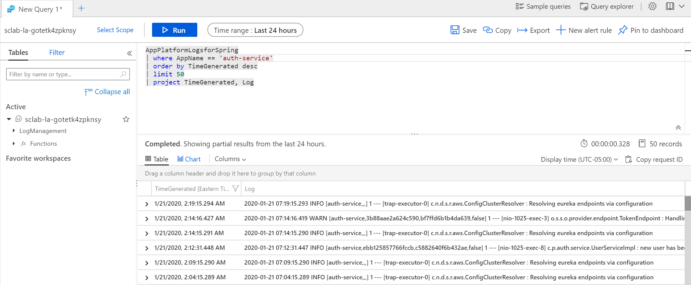

# Troubleshooting

__This guide is part of the [Azure Spring Cloud Migration Lab](../README.md)__

Using Azure Log Analytics to understand what went wrong.

---

We have successfully migrated the application code to Azure Spring Cloud, but what happens when an application misbehaves?

## Streaming the logs

When you run an application on your machine, you can see its output in the console. When you run a microservice on Azure Spring Cloud, you can also see its console output through Azure CLI:

```bash
az spring-cloud app log tail --name account-service -f
```

You should see the console output of `account-service` scroll by on your terminal:


## Query application logs

Streaming the console output as we just did may be helpful in understanding the immediate state of a microservice. However, sometimes it's necessary to look further into the past or to look for something specific. This is easily done with Log Analytics.

In the Azure Portal, navigate to the Azure Spring Cloud instance, and click "Logs" in the "Monitoring" section of the sidebar. This is a shortcut to the Log Analytics workspace that was created earlier. If a tutorial appears, feel free to skip it for now.

This workspace allows to do queries on the aggregated logs, the most common one being to get the latest log from a specific application:

__Important:__ Spring Boot applications logs have a dedicated `AppPlatformLogsforSpring` type.

To see all log entries, paste the following into the query window, and click 'Run'

```kql
AppPlatformLogsforSpring
| order by TimeGenerated desc
| limit 50
```

You might wish to troubleshoot only a specific service, and perhaps see only the columns that will help you troubleshoot:

```kql
AppPlatformLogsforSpring
| where AppName == 'account-service'
| order by TimeGenerated desc
| limit 50
| project TimeGenerated, Log
```



---

⬅️ Previous section: [01 - Migrate a Spring Cloud Application](../00-setup-your-environment/README.md)

➡️ Next section: [03 - Observability and Scaling](../03-observability-and-scaling/README.md)