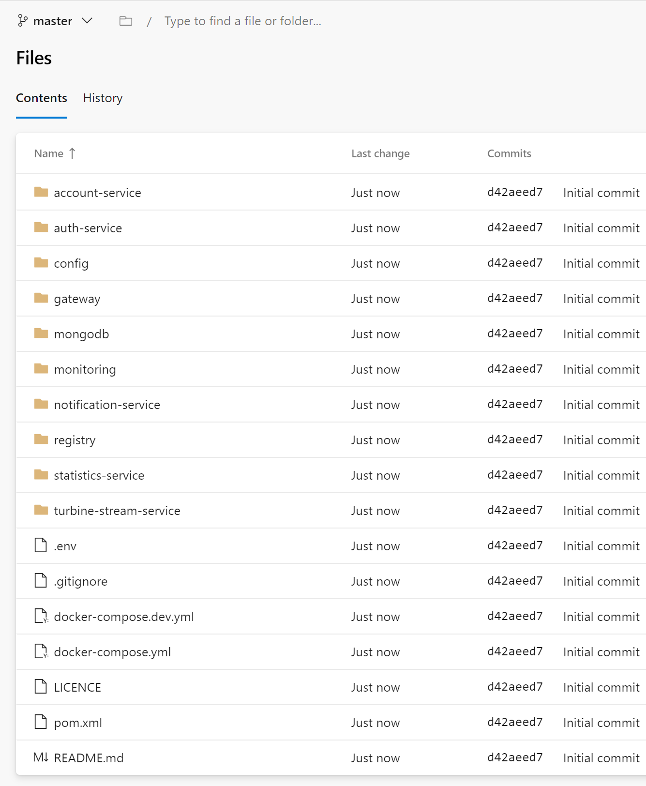
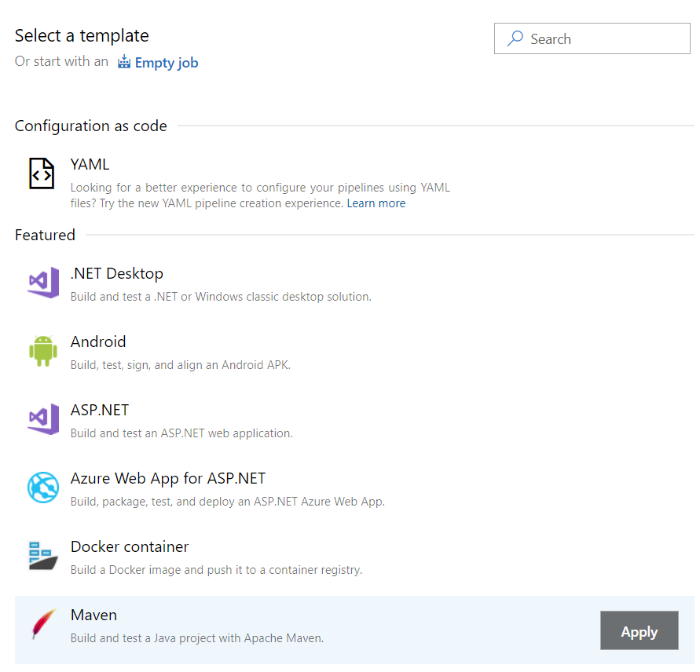
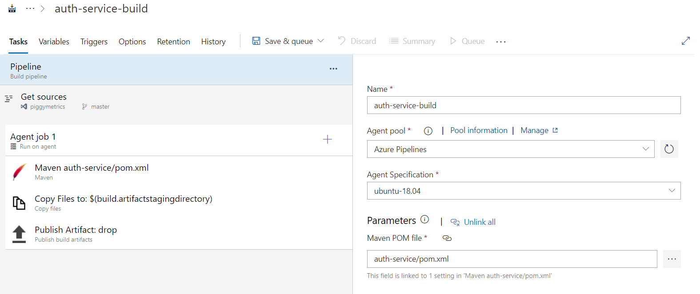
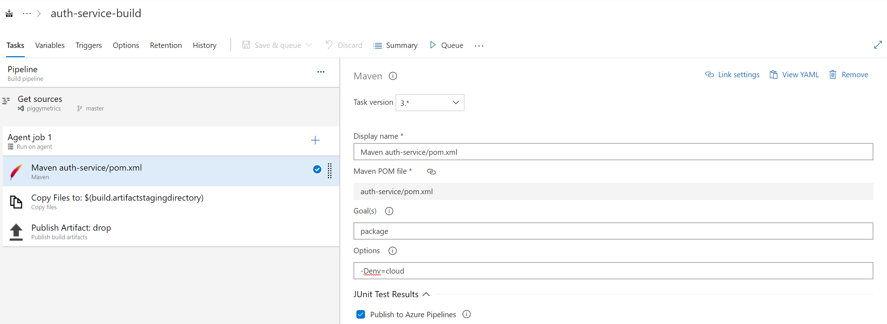
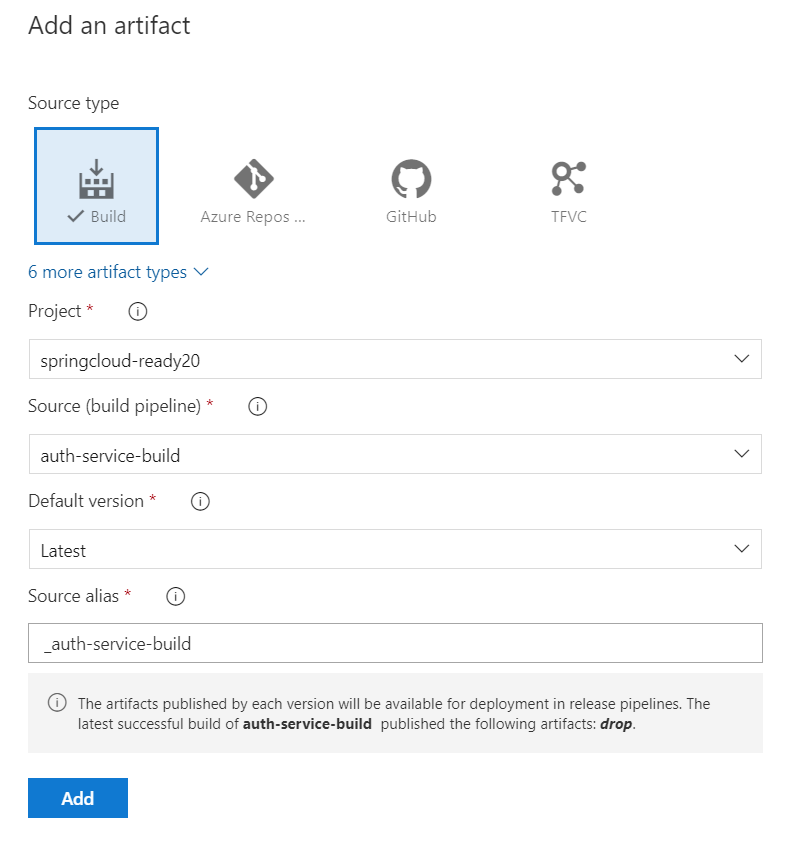
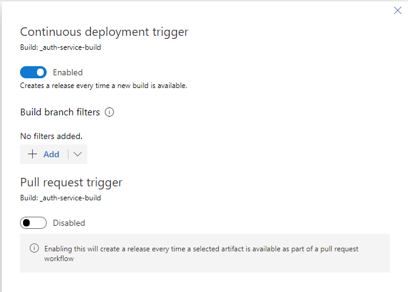
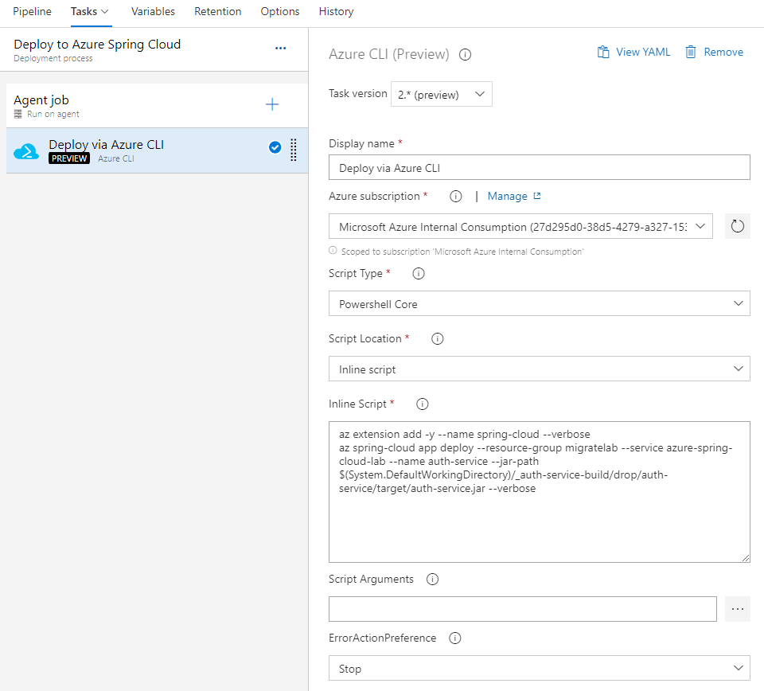
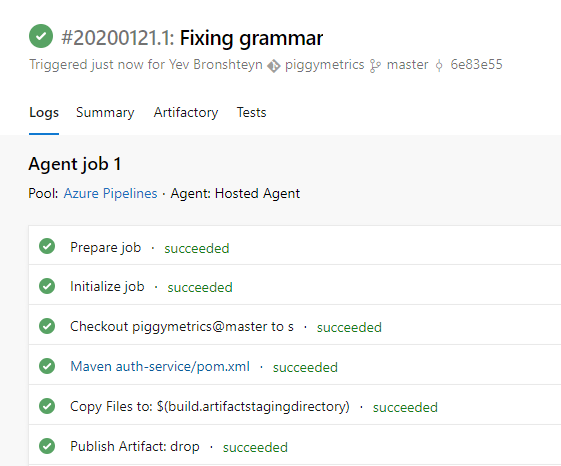
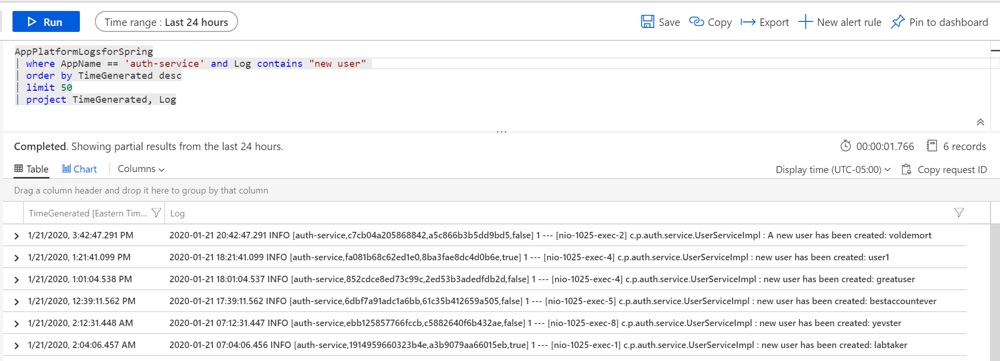

# Enable Continuous Deployment

__This guide is part of the [Azure Spring Cloud Migration Lab](../README.md)__

Creating automated build and release pipelines with Azure DevOps.

---

A key virtue of Microservices is the ability to continuously and independently test and deploy the changes to each one. In this section, we will set up pipelines to build and deploy one of the Microservices we migrated in Section 2.

## Create an Azure DevOps Project

Create a new Azure DevOps project. Commit the contents of the "Piggy Metrics" directory to the root of the Git repository. The resulting repository should look like this:



## Create a build pipeline with Classic UI

Let's first create a build pipeline for `auth-service` using the classic UI, as it is often the most intuitive experience for new customers.

In Azure DevOps, navigate to "Builds" under "Pipelines", and click "New Pipeline". Click on the "Use the classic editor" link at the bottom.

Select the repository you created in the previous step as the source, and on the "Select a Template" pane, click "Maven".



The build pipeline will be created.

Click on the "Pipeline" header at the top. Change the pipeline name to "auth-service-build". Under parameters, change "Maven POM file" to `auth-service/pom.xml`

.

Click on the first step in the pipeline, "Maven auth-service/pom.xml". In the options textbox, add:

```bash
-Denv=cloud
```

This is an environment variable setting to trigger the cloud profile, just as we did when building the application locally.



In the "Save and Queue" dropdown, choose "Save". We will test this build later.

### Create a Build Trigger

Above the build pipeline definition, click on "Triggers". Then, check the "Enable continuous integration" box.


## Create a Release pipeline for Auth Service

Under "Pipelines", click on "Releases" and then on "New Pipeline".

### Define the source artifact

Click on "Empty Job" in the "Select a Template" pane.

Under "Artifacts", click "Add an Artifact".  From the "Source" dropdown, select `auth-service-build`, which we created in the previous section. Then click Add.



Click on the lightning bolt icon on the newly-added build artifact. On the "Continuous deployment trigger" panel, toggle the first switch to enable automatic deployment whenever a build completes.



### Defining the deployment step

__Note:__ Instructions marked with 🚧 are necessary only during the preview.

Click on "Stage 1" in the "Stage" box. Change the Stage name to "Deploy to Azure Spring Cloud".  

🚧 Click on "Agent Job" and select "windows-2019" under Agent Specification.

Click the "+" sign next to "Agent job" and enter "Azure CLI" in the search box. Then, mouse over "Azure CLI" in the results and click the "Add" button.


Click on the new Azure CLI tasks and make the following modifications:

- Set the Display name to "Deploy via Azure CLI"
- 🚧 Set the Task version to `2.* (preview)`
- 🚧 Set the Script Type to PowerShell Core
- Under "Azure Subscription" select the subscription or the service connection that has access to the Azure Spring Cloud instance. If an "Authorize" button appears, click it.
- Under "Script Location", select "Inline Script"
- in the Inline Script box, paste the following, making the indicated substitutions:

```bash
az extension add -y --name spring-cloud --verbose
az spring-cloud app deploy --resource-group <RESOURCE GROUP NAME> --service <AZURE SPRING CLOUD INSTANCE NAME> --name auth-service --jar-path $(System.DefaultWorkingDirectory)/_auth-service-build/drop/auth-service/target/auth-service.jar --verbose
```

- Finally, click on "..." button next to the Arguments box, and create two arguments:

The pipeline is now complete.



## Testing the CI/CD process

__Note:__ If pressed for time, skip the remainder of this section.

Let's change some code in our repository, to see the CI/CD process in action. In the `piggymetrics` source repository, navigate to the file `auth-service/src/main/java/com/piggymetrics/auth/service/UserServiceImpl.java`. Let's fix the grammar of the log message on line 35 by adding `A ` to the log message:

```java
log.info("A new user has been created: {}", user.getUsername());
```

Save and commit the modification directly to master.

Now, navigate to the build pipeline you created, and you should see it run to completion:



Next, click on "Releases". You should see that a new release has been created and successfully deployed.

Last, navigate to the PiggyMetrics application in the browser (via the Gateway URL), and create a new user. Use Log Analytics to search for the new output message:

```kql
AppPlatformLogsforSpring
| where AppName == 'auth-service' and Log contains "new user" 
| order by TimeGenerated desc
| limit 50
| project TimeGenerated, Log
```



## Optimizations

1. To make builds faster and more reliable, [Azure Artifacts Feeds can be configured](https://docs.microsoft.com/en-us/azure/devops/artifacts/maven/upstream-sources?view=azure-devops) to cache 3rd party dependencies instead of fetching them from Maven Central with every build.

1. The Deployment task we implemented with Azure CLI can be reused by adding parametrizing some of the command arguments, such as the resource group name, the Azure Spring Cloud instance name, and the Jar file name. Then, right-click on the task and click "Create Task Group". This will prevent the duplication of the script across multiple microservice pipelines.

---

⬅️ Previous section: [03 - Observability and Scaling](../03-observability-and-scaling/README.md)

➡️ Next section: [05 - Enable Blue-Green Deployment](../05-enable-blue-green-deployment/README.md)
