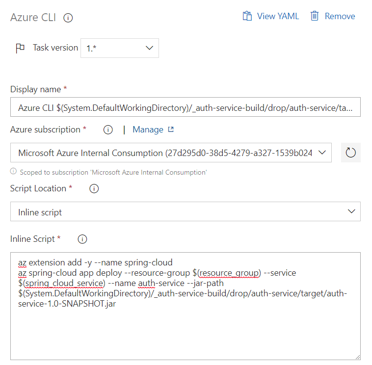

# Enable Continuous Deployment

A key virtue of Microservices is the ability to continuously and independently test and deploy the changes to each one. In this section, we will set up pipelines to build and deploy the Microservices we migrated in Section 2.

## Create an Azure DevOps Project

Create a new Azure DevOps project. Commit the contents of the "Piggy Metrics" directory to the root of the Git repository. The resulting repository should look like this:


## Create a build pipeline with Classic UI

Let's first create a build pipeline for `auth-service` using the classic UI, as it is often the most intuitive experience for new customers.

In Azure DevOps, navigate to "Builds" under "Pipelines", and click "New Pipeline". Click on the "Use the classic editor" link at the bottom.

Select the repository you created in the previous step as the source, and on the "Select a Tempalte" pane, click "Maven".


The build pipeline will be created. Click on the "Pipeline" header at the top.

Change the pipeline name to "auth-service-build". Under parameters, change "Maven POM file" to `auth-service/pom.xml`


Click "Save and Queue". The build should now run and complete successfully.

## Create a Release pipeline for Auth Service

Under "Pipelines", click on "Releases" and then on "New Pipeline".

Click on "Empty Job" in the "Select a Template" pane.

Under "Artifacts", click "Add an Artifact".  From the "Source" dropdown, select `auth-service-build`, which we created in the previous section. Then click Add.


Click on "Stage 1" in the "Stage" box. Change the Stage name to "Deploy to Azure Spring Cloud".  

Click the "+" sign next to "Agent job" and enter "Azure CLI" in the search box. Then, mouse over "Azure CLI" in the results and click the "Add" button.


Click on the new Azure CLI tasks and make the following modifications:

- Under "Azure Subscription" select the subscription or the service connection that has access to the Azure Spring Cloud instance. If an "Authorize" button appears, click it.
- Under "Script Location", select "Inline Script"
- in the Inline Script box, paste the following:

```bash
az extension add -y --name spring-cloud
az spring-cloud app deploy --resource-group $(resource_group) --service $(spring_cloud_service) --name auth-service --jar-path $(System.DefaultWorkingDirectory)/_auth-service-build/drop/auth-service/target/auth-service-1.0-SNAPSHOT.jar
```

Click "Save". 



## Optimizations

1. To make builds faster and more reliable, [Azure Artifacts Feeds can be configured](https://docs.microsoft.com/en-us/azure/devops/artifacts/maven/upstream-sources?view=azure-devops) to cache 3rd party dependencies instead of fetching them from Maven Central with every build.
