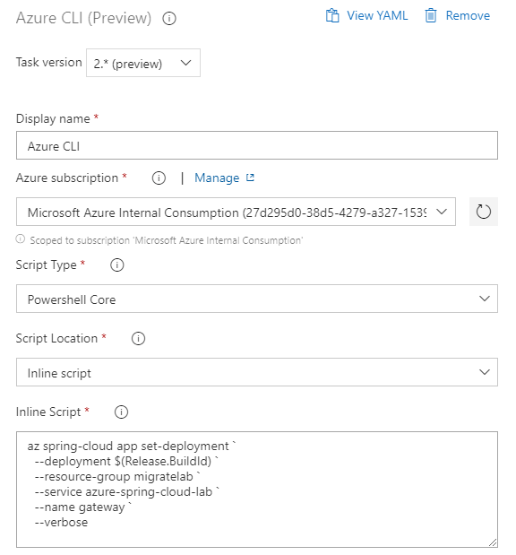
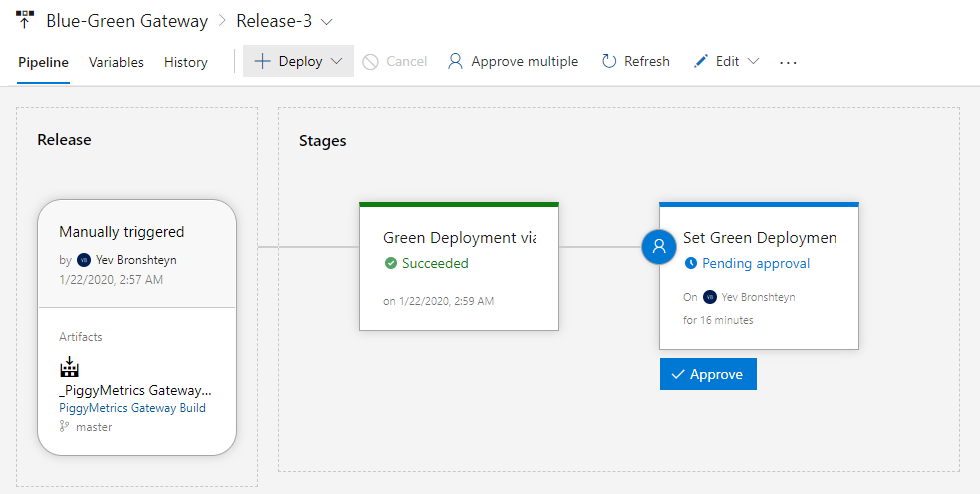
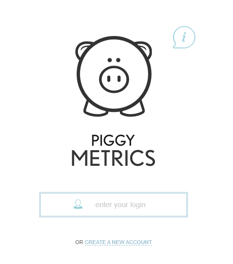

# Enable Blue-Green Deployment

__This guide is part of the [Azure Spring Cloud Migration Lab](../README.md)__

Deploying microservices for testing in production without impacting the user experience.

---

In the previous section, configured build and release pipelines for one of our deployed microservices. We observed how a change made in the code is, in the course of a few minutes, gets automatically deployed to production.

But sometimes, it's desirable to test the change in the production environment but in a way that is not visible to the application's end users. In this section, we will implement this goal with the [Blue-Green deployment pattern](https://www.martinfowler.com/bliki/BlueGreenDeployment.html).

## Create a build pipeline for Gateway

Let's create a build pipeline for the Gateway microservice. Normally, a Spring Cloud Gateway is a thin service without much to modify. In the PiggyMetrics app, however, the Gateway deployment also contains the UI. And we should definitely do some user acceptance testing on UI changes before phasing them in for all customers.

- Navigate to the Azure DevOps project from the previous section. Under "Pipelines", click on "Builds".
- Click on New, and choose "New Build Pipeline."
- Under "Where's your code?", choose "Azure Repos Git"
- Select the repo containing the PiggyMetrics code that you checked in in Section 3.
- Under "Configure your pipeline", select "Existing Azure Pipelines YAML file".
- Under Path, select `/gateway/azure-pipelines.yml`.
- On the "Review your pipeline YAML" page, click "Run".

You now have a complete build pipeline. Back on the "Pipelines" page, rename the pipeline to "Gateway Buid", so we can more easily recognize it later. Then, it's time to deploy.

## Deploy to a "Green" deployment.

__Note:__ Instructions marked with 🚧 are necessary only during the preview.

Under "Pipelines", click on "Releases" and then on "New" and "New release pipeline". Select "empty job" on the templates pane.

Rename the pipeline to "Gateway - Blue/Green".

Click on "+Add" under Artifacts, and select the build Gateway build we just created.


Click the Lightning Bolt to bring up the "Continuous deployment trigger" page, and toggle the first switch to enable continuous deployment.


Click on "Stage 1". 

- Rename the stage to "Green deployment"
- 🚧 Click on "Agent job". Under "Agent Specification", select `windows-2019`.
- Click the "+" sign next to "Agent job" and enter "Azure CLI" in the search box. Then, mouse over "Azure CLI" in the results and click the "Add" button.


Click on the new Azure CLI task and make the following modifications:

- Set the Display name to "Green Deployment via Azure CLI"
- 🚧 Set the Task version to `2.* (preview)`
- 🚧 Set the Script Type to PowerShell Core
- Under "Azure Subscription" select the subscription or the service connection that has access to the Azure Spring Cloud instance. If an "Authorize" button appears, click it.
- Under "Script Location", select "Inline Script"
- in the Inline Script box, paste the following, making the indicated substitutions:

```powershell
az extension add -y --name spring-cloud 
az spring-cloud app deployment create `
 --resource-group migratelab `
 --service azure-spring-cloud-lab `
 --name "build$(Build.BuildId)" `
 --app gateway `
 --jar-path "$(System.DefaultWorkingDirectory)/$(Release.PrimaryArtifactSourceAlias)/drop/gateway/target/gateway.jar" --verbose
```

Save the pipeline.

## Routing the Production Traffic to the Green Deployment

Under "Stages", click "Add" and select "New stage". Select "Empty job".

Name the stage "Set Green Deployment".

Edit the stage. 🚧 Click on "Agent Job". Select "windows-2019" under Agent Specification.

Add an Azure CLI task and make the following modifications:

- Set the Display name to "Set Deployment with Azure CLI"
- 🚧 Set the Task version to `2.* (preview)`
- 🚧 Set the Script Type to PowerShell Core
- Under "Azure Subscription" select the subscription or the service connection that has access to the Azure Spring Cloud instance. If an "Authorize" button appears, click it.
- Under "Script Location", select "Inline Script"
- in the Inline Script box, paste the following, making the indicated substitutions:

```powershell
az extension add -y --name spring-cloud
az spring-cloud app set-deployment `
  --deployment "build$(Build.BuildId)" `
  --resource-group migratelab `
  --service azure-spring-cloud-lab `
  --name gateway `
  --verbose
```



Back on the pipeline, click on the pre-deployment conditions icon next to the new stage:


Flip the "pre-deployment approvals" toggle, and enter yourself as an approver.

## Testing the blue-green deployment

We now have a complete end-to-end blue-green deployment pipeline. Let's watch it in action.

Edit the file `gateway/src/main/resources/static/index.html`. Search for the string `create new account` and replace it with `create a new account`. Commit the change.

- The gateway JAR file gets built automatically
- The first stage of the release pipeline publishes that jar to a new deployment.
- Once the above tasks complete, navigate to the Azure Spring Cloud Instance in the Azure Portal. Click on "Deployments". You should see the new deployment become available in the "Staging Deployment" column:


Click on the staging deployment. Copy the URL shown under "Test Point" and paste it into a new browser tab. You should now see the new wording on the bottom of the application login page: "Create **a** new account".

Note that if you go to the original public URL at this time, you will still see the old language: "Create new account".

Now that we have tested this change in the production environment, let's expose it to our users. Because we added a manual approval to the "Set Deployment" stage of the release pipeline, you should have an email in your mailbox with the subject similar to

```text
[Pre-deployment approval pending] Blue-Green Gateway > Release-3 : Set Green Deployment
```

Click "View Approval" in that email. You should be taken to a view of your pipeline with an "Approve" button under the "Set Green Deployment" stage. Click it and approve the deployment.



Watch the second stage of the pipeline run. Once it completes, navigate to the public Gateway URL. You should now see the new language on it.



__Note:__ the prior deployment does not automatically get deleted. It's still available (and still consuming resources), should you need to revert at a moment's notice. We may wish to subsequently add another delayed stage to our pipeline that deletes the old deployment after some delay.

---

⬅️ Previous section: [04 - Enable Continuous Deployment](../04-enable-continuous-deployment/README.md)

➡️ Next section: [Conclusion](../99-conclusion/README.md)